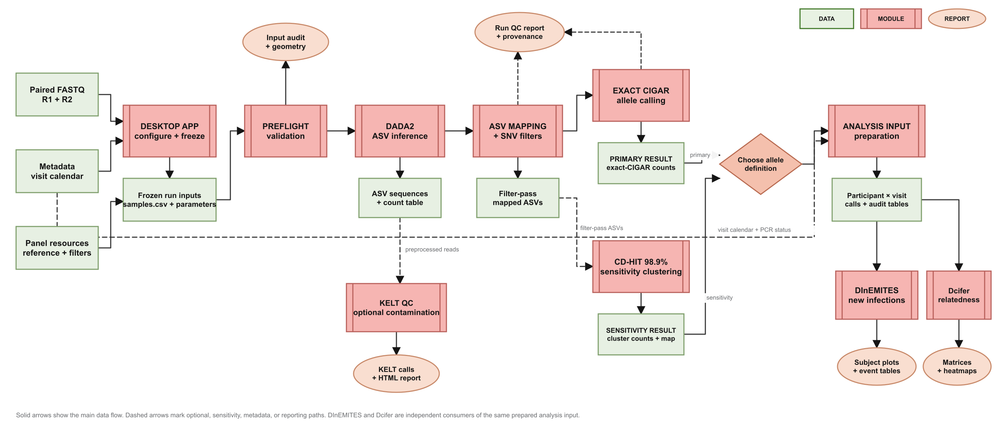

<div align="center">
  
</div>

# malaria-amplicon-nf

`malaria-amplicon-nf` is a local desktop application for SIMPLseq malaria amplicon sequencing. It scans paired FASTQ files, prepares a reproducible sample sheet, runs the Nextflow workflow, presents run-level quality control, and prepares shared allele tables for DINEMITES and Dcifer.

All input data and results remain on the local computer. The exact CIGAR allele table is the primary result. KELT contamination screening and CD-HIT clustering are separate quality-control and sensitivity paths; neither silently replaces the primary allele definition.

## Workflow Overview

<p align="center">
  <a href="assets/workflows/malaria-amplicon-workflow-overview.svg">
    
  </a>
</p>

## Install

Download the Windows or Apple Silicon macOS installer from:

https://github.com/a-nadeem9/malaria-amplicon-nf/releases

Windows requires WSL 2. The application reuses an available WSL distribution and installs the managed analysis environment inside it. If WSL is present but no Linux distribution is registered, the launcher installs standard Ubuntu before continuing. macOS uses the same pinned workflow environment without WSL.

## Run The Application

1. **Configuration:** choose the FASTQ folder, review paired reads and parsed sample identifiers, then optionally map a metadata file.
2. **Run:** select one or more sequencing libraries, choose the output folder, and start the workflow.
3. **Results:** inspect the run summary, filtering audit, final tables, and saved output folder.
4. **Downstream analysis:** prepare one shared participant-visit allele table, then run DINEMITES or Dcifer against that saved input.

Every run stores its generated `samples.csv`, parameters, logs, checksums, reports, and result tables in one run folder.

## Metadata

Metadata is optional for the sequencing workflow. Without metadata, the application analyzes the sequenced samples and uses dates that can be parsed from filenames or explicitly supplied fallbacks.

For a reproducible longitudinal visit calendar, provide a CSV, TSV, or XLSX file and confirm the worksheet, column mapping, and study-specific value meanings in the application.

| Information | Requirement | Purpose |
| --- | --- | --- |
| Participant or subject ID | Required for metadata matching | Links visits to the participant parsed from the sample name |
| Collection date or visit month | Required for calendar visits | Orders visits and distinguishes longitudinal observations |
| PCR or qPCR result | Strongly recommended | Distinguishes PCR-negative visits from PCR-positive visits without retained genotypes |
| Season | Optional | Available as a DINEMITES covariate when the study defines it |
| Age and sex or gender | Optional | Available as explicitly selected DINEMITES covariates |
| Site, status, parasite density, or other fields | Optional | Preserved for review and future study-specific analyses |

Common headings such as `participant_id`, `patient_id`, `subject`, `collection_date`, `visit_date`, `month`, `pcr`, `qpcr`, `season`, `age`, and `sex` are detected automatically. Any available column can also be mapped manually. The application does not guess the meaning of opaque study codes: users must classify each PCR result value as positive, negative, ignored, or requiring review.

Exact dates are retained when available. If only a month is known, the selected fallback year and day are recorded in the run provenance. Longitudinal preparation can then distinguish:

- sequenced genotype-positive visits;
- PCR-negative visits with no genotype expected;
- PCR-positive visits where a genotype is missing;
- unresolved visits that require review.

## Supported Panel

The published SIMPLseq panel contains six loci: `CSP`, `TRAP`, `WDCP`, `KELT`, `SERA8`, and `SURFIN4.2`. The application reports which core loci were detected, which are missing, and whether additional loci were analyzed. `KELT` is also used for the optional PCR-contamination tracking path described by SIMPLseq.

## FASTQ Names

Supported paired-read patterns include:

```text
*_R1.fastq.gz / *_R2.fastq.gz
*_R1_001.fastq.gz / *_R2_001.fastq.gz
*_R1.fq.gz / *_R2.fq.gz
*_R1_001.fq.gz / *_R2_001.fq.gz
```

Library identifiers are parsed separately from biological sample identifiers, allowing any one library, several selected libraries, or all detected libraries to be run together.

## Main Outputs

| File | Description |
| --- | --- |
| `samples.csv` | Frozen sample sheet used for the run |
| `reports/run_summary.html` | Run summary and quality-control report |
| `reports/asv_filtering_summary.txt` | ASV counts and requirements at each filtering stage |
| `run_dada2/seqtab_iseq.tsv` | DADA2 ASV count table |
| `run_dada2/ASV_mapped_table.tsv` | ASVs mapped to amplicon targets |
| `run_dada2/asv_to_cigar.tsv` | Exact ASV-to-CIGAR allele map |
| `run_dada2/seqtab_cigar.tsv` | Primary exact-CIGAR count table |
| `cdhit/cdhit_cluster_membership.tsv` | Filter-pass ASVs grouped within each locus at 98.9% identity |
| `cdhit/cdhit_cluster_counts.tsv` | Read counts summed within each CD-HIT cluster |

Controls remain available for run-level QC but are excluded from participant-level downstream tables. The shared analysis input applies the chosen abundance rule to each technical replicate, requires replicate agreement, and then merges accepted replicates into one participant-visit record.

## DINEMITES

DINEMITES compares alleles across a participant's ordered visits to estimate new versus persistent infection. The application exposes the Simple, Clustering, and Bayesian models, saves the exact input table used, and keeps primary exact-allele results separate from optional CD-HIT sensitivity results.

Common outputs include allele probabilities, new-infection summaries, molFOI summaries, model diagnostics, subject-level tables, and full-resolution longitudinal plots.

## Dcifer

Dcifer estimates complexity of infection and pairwise relatedness from the same prepared allele table. Common outputs include COI estimates, pairwise relatedness, p-value matrices, and scalable heatmaps. Results based on one locus or on allele frequencies estimated from the current run are labelled exploratory.

## References

- Schwabl P, Amaya-Romero J-E, Neafsey DE, et al. SIMPLseq: a high-sensitivity *Plasmodium falciparum* genotyping and PCR contamination tracking tool. *Malaria Journal*. 2026. https://pmc.ncbi.nlm.nih.gov/articles/PMC12958562/
- Broad Institute. malaria-amplicon-pipeline. https://github.com/broadinstitute/malaria-amplicon-pipeline
- Nickols WA, Schwabl P, Niangaly A, Murphy SC, Crompton PD, Neafsey DE. Distinguishing new from persistent infections at the strain level using longitudinal genotyping data. 2025. https://pmc.ncbi.nlm.nih.gov/articles/PMC11839113/
- Gerlovina I, Gerlovin B, Rodriguez-Barraquer I, Greenhouse B. Dcifer: an IBD-based method to calculate genetic distance between polyclonal infections. *Genetics*. 2022;222(2):iyac126. https://academic.oup.com/genetics/article/222/2/iyac126/6674513
